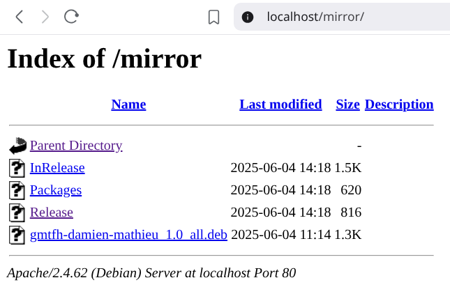
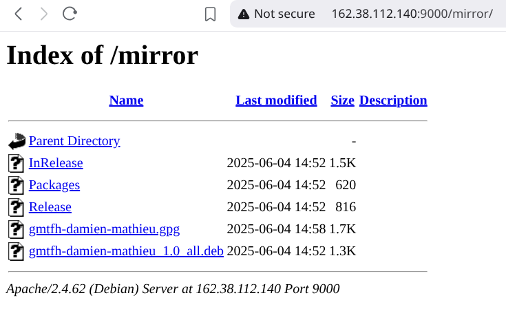

# GMTFH - Give Me The F***ing Hour

A Rastafarian-themed time display utility that shows the current time in different time zones.

## Description

GMTFH (Give Me The F***ing Hour) is a simple command-line utility that displays the current time in multiple time zones with a Rastafarian twist. Perfect for when you need to know the time but want it delivered with some island vibes. Main purpose is to learn how to create deb package with a fun project.

## Features

- Displays current time in Paris (local time)
- Displays current time in Jamaica
- Rastafarian-themed output messages

## Prerequisites

Before you begin, ensure you have the following installed and configured:

*   **GPG Key:** You need a GPG key to sign your repository. If you don't have one, you can generate it using `gpg --full-generate-key`.
*   **Apache2:** This is used to serve your local mirror over HTTP. Install it with `sudo apt update && sudo apt install apache2`.
*   **dpkg-dev:** Required for building Debian packages. Install it with `sudo apt install dpkg-dev`.

## Setting Up a Local Mirror

Follow these steps to create and serve a local Debian repository.



### 1. Install Apache

First, install the Apache web server, which will host your local mirror.

```bash
sudo apt update
sudo apt install apache2
```

### 2. Create Mirror Directory

Create a directory to store your Debian packages.

```bash
sudo mkdir -p /var/www/html/mirror
```

### 3. Build the Debian Package

Use the `make_deb` script to build the `gmtfh-damien-mathieu` package.

```bash
./make_deb
```

This will create a `gmtfh-damien-mathieu_1.0_all.deb` file in the project root.

### 4. Move the Package to the Mirror

Move the newly created `.deb` file to your Apache mirror directory.

```bash
sudo mv gmtfh-damien-mathieu_1.0_all.deb /var/www/html/mirror/
```

### 5. Create and Sign the Release

Run the `make_release` script to generate the repository metadata and sign it with your GPG key.

```bash
./make_release /var/www/html/mirror YOUR_GPG_KEY_ID
```

Replace `YOUR_GPG_KEY_ID` with your actual GPG key ID. This will create the `Packages` and `Release` files, and a signed `InRelease` file.

### 6. Export Your GPG Key

Export your public GPG key so that users of your repository can add it to their trusted keys.

```bash
gpg --export YOUR_GPG_KEY_ID > gmtfh-damien-mathieu.gpg
sudo cp gmtfh-damien-mathieu.gpg /var/www/html/mirror/
```
## Why Sign the Release File?

In a Debian repository, the `Release` file is signed (rather than each individual `.deb` package) to create a secure "chain of trust" that protects the integrity of all packages in the repository.

Here's how this process ensures the integrity of every `.deb`:

1. **The `Release` file is a manifest**  
   It lists all repository metadata files (like `Packages`), and includes their checksums (cryptographic hashes).

2. **You sign the `Release` file with your GPG key**  
   This produces a signed `InRelease` file. Only someone with your private key could have created this valid signature.

3. **APT verifies the signature**  
   When a user runs `sudo apt update`, APT downloads the `InRelease` file and checks its signature against your public GPG key (which the user has installed and trusted).

4. **APT trusts the checksums in the signed `Release`**  
   If the signature is valid, APT knows the `Release` file hasn’t been altered. It then checks the listed checksums against the downloaded `Packages` file(s).

5. **The `Packages` file contains checksums for all `.deb` files**  
   APT uses the `Packages` file (whose integrity is now trusted) to verify the checksums of every individual `.deb` package it downloads.

**Summary:**  
By signing only the `Release` file, you create an unbroken trust chain:  
GPG signature → `Release` file → `Packages` file(s) → each `.deb` file.

This means that as long as the user has your public key and the signature verifies, APT guarantees that all packages it installs are exactly as you published them, with no tampering along the way.

## Installation from Mirrors

### From Local Mirror

1.  Add the local repository to your sources list, making sure to use the `signed-by` option for security.

    ```bash
    echo "deb [signed-by=/etc/apt/trusted.gpg.d/gmtfh-damien-mathieu.gpg] http://localhost/mirror ." | sudo tee /etc/apt/sources.list.d/gmtfh-mirror.list
    ```

2.  Download the GPG key from the mirror and add it to your system's trusted keys.

    ```bash
    wget http://localhost/mirror/gmtfh-damien-mathieu.gpg
    sudo cp gmtfh-damien-mathieu.gpg /etc/apt/trusted.gpg.d/
    ```

3.  Update your package list and install the package.

    ```bash
    sudo apt update
    sudo apt install gmtfh-damien-mathieu
    ```

### Using a Remote Test Mirror

You can also use a remote test mirror instead of a local one. Here's how to add the remote mirror at http://162.38.112.140:9000/mirror/ to your sources list with proper GPG verification:

```bash
# Download the GPG key from the remote mirror
wget http://162.38.112.140:9000/mirror/gmtfh-damien-mathieu.gpg

# Copy the key to the trusted.gpg.d folder
sudo cp gmtfh-damien-mathieu.gpg /etc/apt/trusted.gpg.d/
sudo chmod 644 /etc/apt/trusted.gpg.d/gmtfh-damien-mathieu.gpg

# Add the repository with signed-by option
echo "deb [signed-by=/etc/apt/trusted.gpg.d/gmtfh-damien-mathieu.gpg] http://162.38.112.140:9000/mirror ./" | \
  sudo tee /etc/apt/sources.list.d/gmtfh-remote-mirror.list

# Update and install
sudo apt update
sudo apt install gmtfh-damien-mathieu
```


This configures your system to verify packages from the remote mirror using the downloaded GPG key, ensuring that the packages you install are authentic and haven't been tampered with.

## Usage

Simply run the command in your terminal:

```bash
gmtfh
```

## Uninstallation

To uninstall the package, run:

```bash
sudo dpkg -r gmtfh-damien-mathieu

# Or if you installed it with apt

sudo apt remove gmtfh-damien-mathieu
```

To remove the repository from your sources list, run:

```bash
sudo rm /etc/apt/sources.list.d/gmtfh-remote-mirror.list
```

To remove the GPG key from your trusted keys, run:

```bash
sudo rm /etc/apt/trusted.gpg.d/gmtfh-damien-mathieu.gpg
```

## Author

Damien Mathieu
## License

This is free software; see the source for copying conditions.
